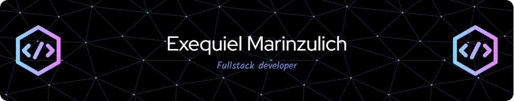

### Hola 👋, Mi nombre es Exequiel
#### Bienvenido a mi Repositorio de Github!
![Bienvenido a mi Repositorio de Github!]

-Hincha de Boca Jrs
-Argentino
-GYM
-Amor a los animales pero especialmente a los perros

Habilidades: 
           
  

- 🔭 Estoy trabajando en en mi crecimiento como Desarrollador web, en busca de un nuevo trabajo 
- 🌱 Estoy aprendiendo .NET e Ingles 
- 👯 Quiero colaborar con con la evolucion del desarrollo web y la inteligencia artificial 
- 💬 Pregúntame acerca de mi  
- 📫 Cómo contactarme: exemarinzulich@gmail.com 
- 😄 Pronombres: Eze - Zeke 
- ⚡ Dato curioso: Soy ambidiestro y alérgico a los gatos  

  

